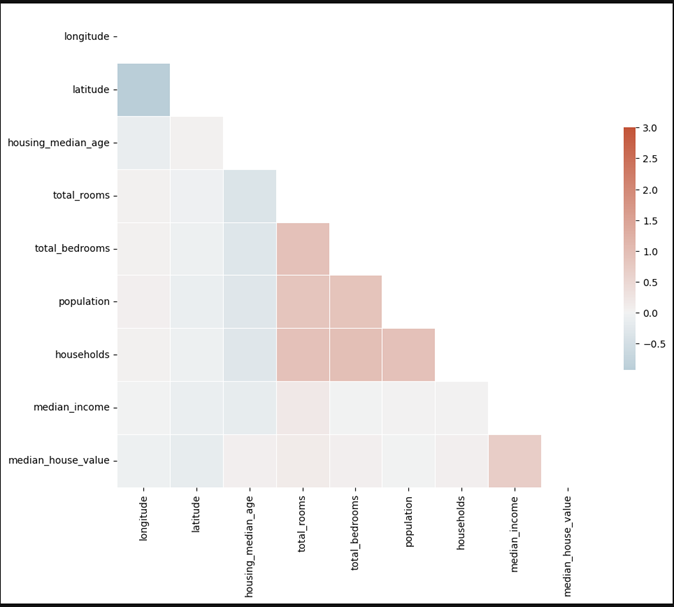

# Using ML to get the data, discover and visualize the data to gain insights
---

The following ML checklist has been followed in this project

1. Understand the problem statement
2. Import the required libraries
3. Fetch and read the required data set
4. Explore the data
5. Split the dataset using _Stratified Splits [imp when dealing with small dataset]_

   _Stratified Splits:_ Split the dataset based on specified column where we want our **train & test** sets to have the same apporximate distribution.
   This needs to be done before any substantial visualization, in this way **_biases inherent_** can be avoided
```
from sklearn.model_selection import train_test_split
X_train, X_test, y_train, y_test = train_test_split(X, y, test_size = 0.33)
X_train
```

6. Visualize the data
   
   Data visualization is one of the most important part of the modelling process. Statistics are underpar in providing details about a dataset
   - Using Histogram
     ```
     foo.hist(bins=50, figsize=(20, 15))
     ```

   - Using Correlation Matrices
     
     ```
     corr = var.corr()
     mask = np.triu(np.ones_like(corr, dtype=bool))

      f, ax = plt.subplots(figsize=(11,9))
      cmap = sns.diverging_palette(230,20, as_cmap=True)
      sns.heatmap(corr, mask=mask, cmap=cmap, vmax=3, center=0, 
            square=True, linewidth=.5, cbar_kws={"shrink": .5})
     ```
     

     
---


> [!NOTE]
> The project contains the test data set of a real estate company
